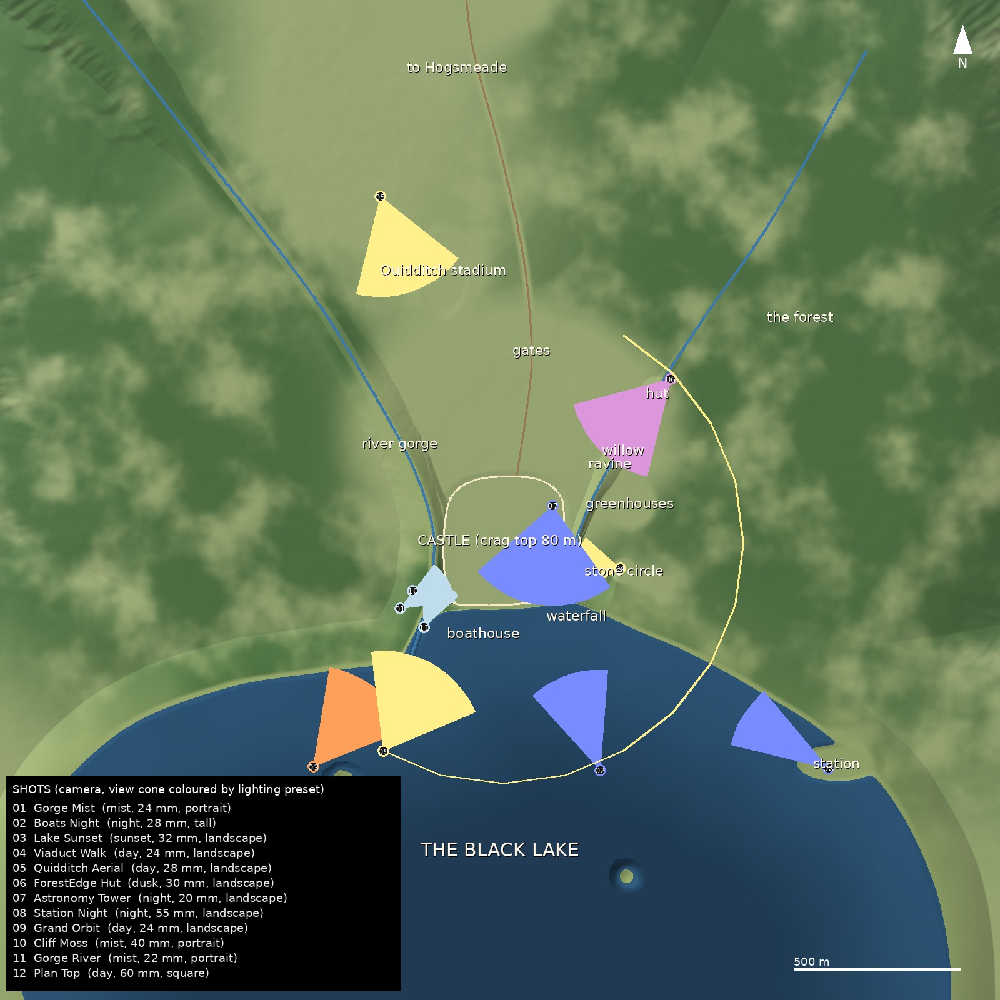

# The Castle on the Crag — a high-poly Highland castle world for Unreal Engine 5

A Gothic castle on a jointed-granite crag above a black Highland loch: a river gorge on one side, a ravine and a
waterfall on the other, the grounds with the stadium, the hut, the greenhouses and the stone circle, a forest of
spruce, and a ring of eroded mountains. It's built to be rendered in Unreal Engine 5 with Nanite and Lumen. It was
made after your references: the castle above the misty gorge (ref 1), the lantern boats under the moon (ref 2), the
pen sketch (ref 3), the sunset silhouette (ref 4), and the three site plans for the layout. **Everything is original
and generated from code.** There are no scanned assets, no copied geometry and no copied textures. The reference
images are not part of this repository.



| | |
|---|---|
| Unique geometry | **8.5 M triangles**, all Nanite: the 1.2 km hero terrain (3.6 M), the castle (1.85 M), the valley and mountains (1.6 M), the grounds, the water and a 1.3 M-triangle vegetation / rock library |
| Instances | **623 000** Nanite instances, about **45 billion instanced triangles**: 217 k spruces, 64 k young spruces, 31 k pines, 14 k birches, 4 k dead trees, 123 k moss cushions, 32 k granite boulders, 132 k grass clumps, 6 k ferns, the willow and 14 lantern boats |
| Alpha cards | **none**. Every needle spray, leaf, moss cushion and grass blade is opaque geometry, which suits Nanite and gives clean shadows. |
| Textures | 2K procedural PBR sets (granite, castle ashlar, dressed trim, moss, slate, grass, forest floor, shore, dirt, lead, leaded glass, wood, bark, needles…) plus macro and detail maps, water normals, waterfall, stars and moon |
| Shots | 12 cameras with Level Sequences and Movie Render Queue jobs, each carrying its own lighting preset (see [Shots](#shots-camera-placements-for-the-main-events)) |

## Can this reach the realism of references 1 and 2?

**Yes for the world, the geometry and the light. Getting the very last step of surface realism depends on scanned
materials.** Here is what decides the result.

1. **Cliff and moss (refs 1 and 2) are geometry here, not texture.** The crag, the gorge, the ravine and the lake
   cliffs are a signed-distance field built in three layers:
   - **Landform:** a terrain height field with tiered cliff profiles, so the faces have talus aprons, ledges and
     upper walls.
   - **Granite structure:** jointed blocks, each a flat tilted facet that leans back or overhangs. The blocks carry
     open joints, sheeting grooves, buttresses and couloirs.
   - **Meshing:** marching cubes at 0.75 m, then decimated to 3.6 M triangles.

   On top of that, 123 k moss cushions sit on the up-facing rock, young spruces grow on the ledges, and boulders lie
   on the talus. Nanite renders all of it at full density. This is the same approach real granite environments use in
   UE5, and it is what makes ref 1's crag readable.
2. **Surface materials are the one place where a scan beats code.** The procedural granite, moss and castle-stone
   textures are good (see the previews). Megascans surfaces of mossy granite and Highland moss are better at
   close range. Every main material therefore exposes its textures as parameters, so swapping in scans is a
   five-minute job; see [Pushing it to photoreal](#pushing-it-to-photoreal).
3. **Light and atmosphere carry refs 1 and 2 as much as the models do.** The builder sets up:
   - Lumen GI and reflections, virtual shadow maps, sky atmosphere and volumetric clouds.
   - Height fog with volumetric fog.
   - Five local fog volumes: mist banks in the gorge, under the lake cliff, in the ravine and over the forests.
   - A moon with a star dome, windows that glow at night, and lanterns on the boats.

   Five presets (mist, day, sunset, dusk, night) are keyed into the shots.
4. **Refs 1 and 2 are themselves highly polished, AI-like images.** Their final look also comes from grading. Render
   the EXR passes and grade them (contrast, a cool-green mist tint, a warm window glow) to match them exactly.

**What could not be done here:** this was built in a cloud container with no GPU and no Unreal Engine. So:

- The builder is verified the way the Flooded Rotunda's was (see [What is and is not verified](#what-is-and-is-not-verified)).
- The images in `Previews/` are **Cycles path-traced previews of exactly these assets, cameras and presets.** They
  are **not Unreal renders**.
- Expect to tune exposure and fog on the first open. To let Claude drive Unreal on your PC, see
  `LOCAL_CLAUDE_PROMPT.md`.

## Quick start (Unreal Engine 5.6, Windows, DX12 GPU with ≥ 12 GB VRAM recommended)

1. Open `WizardingWorld/WizardingWorld.uproject`. It enables the Python Editor Script, Editor Scripting Utilities,
   Sequencer Scripting and Movie Render Queue plugins. Accept the restart if Unreal offers one.
   - Or run `run_windows.bat` / `run_mac_linux.sh` after editing the engine path. This opens the project and runs the
     builder in one go.
2. Open **Window ▸ Output Log**, switch the console from *Cmd* to *Python*, and run:

   ```python
   import build_world; build_world.run()
   ```

   (or **Tools ▸ Execute Python Script…** → `Content/Python/build_world.py`).
3. Wait. The first run imports 80 FBX meshes, builds Nanite and compiles about 26 materials, then places 623 k
   instances. 30–90 minutes is normal. The log shows `[WW] >>> stage` / `<<< stage done` lines and ends with a summary.
   The level `/Game/WizardingWorld/Maps/WizardingWorld` opens lit with the **mist** preset.
4. Look through a shot: in the Outliner right-click `CAM_01_Gorge_Mist` ▸ *Pilot*. Switch the editor lighting with
   `build_world.apply_preset("night")` (`mist`, `day`, `sunset`, `dusk`, `night`).
5. **Render.** Run `import render_shots; render_shots.run()`, which renders every queued shot, or pass a list such as
   `render_shots.run(["CAM_02_Boats_Night"])`. Alternatively use Window ▸ Cinematics ▸ **Movie Render Queue** ▸
   *Render (Local)*. Every shot's sequence carries its own lighting preset, so the whole queue renders correctly in
   one go. Images go to `WizardingWorld/Saved/MovieRenders/<shot>/`.

Re-running `build_world.run()` is safe: assets are replaced and the actors from the previous build are removed first.

## Shots (camera placements for the main events)

| # | Shot | Event / reference | Preset | Lens | Format |
|---|---|---|---|---|---|
| 01 | `CAM_01_Gorge_Mist` | the castle above the gorge, river below, misty morning (**ref 1**); 10 s drift | mist | 24 mm | 9:16 |
| 02 | `CAM_02_Boats_Night` | first-years crossing the lake by lantern light, moon behind the spires (**ref 2**); 12 s push-in | night | 28 mm | 2:3 |
| 03 | `CAM_03_Lake_Sunset` | the Great Hall end and the crag from the lake at sunset (**ref 4**) | sunset | 32 mm | 16:9 |
| 04 | `CAM_04_Viaduct_Walk` | walking the viaduct into the castle; 12 s | day | 24 mm | 16:9 |
| 05 | `CAM_05_Quidditch_Aerial` | over the stadium towards the castle; 10 s | day | 28 mm | 16:9 |
| 06 | `CAM_06_ForestEdge_Hut` | from the forest edge by the hut, windows lighting up | dusk | 30 mm | 16:9 |
| 07 | `CAM_07_Astronomy_Tower` | from the top of the tallest tower over the moonlit lake | night | 20 mm | 16:9 |
| 08 | `CAM_08_Station_Night` | from the station across the lake to the lit castle | night | 55 mm | 16:9 |
| 09 | `CAM_09_Grand_Orbit` | 24 s orbit round the whole castle | day | 24 mm | 16:9 |
| 10 | `CAM_10_Cliff_Moss` | detail: moss, ledges and the little house on the gorge face | mist | 40 mm | 9:16 |
| 11 | `CAM_11_Gorge_River` | from the river up the gorge to the castle | mist | 22 mm | 9:16 |
| 12 | `CAM_12_Plan_Top` | the site plan from above | day | 60 mm | 1:1 |

**Changing the shots.** Shots are defined in `generator/shots.py`, which is the single source of truth: the scatter
cuts sight-line clearings for them, the previews render them, and `scene.json` carries them to Unreal. To move a
camera, edit its position there, then run `python build_all.py --only scatter,export`. You can also move the
`CAM_*` actor in Unreal and re-key the sequence by hand. Output resolutions are 3840 px on the long side.

## Lighting presets

| preset | light | atmosphere |
|---|---|---|
| `mist` (ref 1) | low morning sun from the east-south-east, 16° | dense height fog with volumetric fog, mist banks in the gorge, under the cliff and over the forests, cool-green grade |
| `day` | sun at 42° from the south-south-west | light haze, volumetric clouds |
| `sunset` (ref 4) | sun 3.5° above the west-north-west horizon, orange | thin haze, mist over the lake, windows starting to glow |
| `dusk` | sun just below the horizon | blue hour, lit windows, mist in the valley |
| `night` (ref 2) | moonlight from the north-north-west (behind the castle from the lake), blue | stars, a cinematic moon disc, lit windows, boat lanterns, mist on the water |

The values live in `SourceAssets/scene.json` (`presets`) and in the `CFG` block at the top of `build_world.py`:
window glow, lantern intensity, water absorption and scattering, instance density and render samples.
`MPC_World` (Night, WindowGlow, MossGain, Wetness) drives the materials, so moss coverage is a single scalar.

## What's in this repository

```
WizardingWorld/                    Unreal Engine 5.6 project (content-only, opens without compiling)
  WizardingWorld.uproject
  Config/                          Lumen + VSM (8192 pages) + Nanite + DX12/SM6, volumetric fog, sky atmosphere
  Content/Python/build_world.py    the one-step scene builder (run inside the editor)
  Content/Python/render_shots.py   renders the queued shots with Movie Render Queue
  SourceAssets/                    fbx/ (80 meshes, centimetres, Z-up) + fbx/instances/ (32 record files)
                                   textures/ (2K PBR) + manifest.json + scene.json (shots, presets, mist banks, lanterns)
generator/                         the procedural generators (numpy / numba / scipy / manifold3d / Blender-as-a-module)
Previews/                          Cycles renders of every shot (NOT Unreal renders)
docs/layout_map.jpg                the plan above
run_windows.bat, run_mac_linux.sh  open the project and run the builder in one go
LOCAL_CLAUDE_PROMPT.md             for a Claude Code session on the PC that drives Unreal
```

### How the world is built (`generator/`)

| module | what it makes |
|---|---|
| `world.py` | **The layout and the height field.** It defines the crag outline, the gorge, the ravine, the shoreline, the islands, the grounds, flattened sites and tiered cliff profiles. It also runs hydraulic and thermal erosion on the mountain ring (`fastnoise.py`: numba noise, Worley cells, droplet erosion). |
| `rockfield.py`, `core.py` | **The 1.2 × 1.2 km hero terrain.** It combines the height field with the granite SDF. Each point uses the rock weight and face frame of its nearest surface point, via exact distance transforms. It is meshed with marching cubes, Taubin-smoothed and quadric-decimated, then gets masks (rock, moss, forest floor, shore, road and SDF ambient occlusion) in UV1–UV3. |
| `terrain.py` | **The valley and mountains outside the core.** This is an adaptive Delaunay mesh at 3–12 m spacing. It overlaps the core under a 0.45 m dip, so there is no seam. |
| `castle_kit.py`, `castle.py` | **The castle.** Pieces: round and square towers, the Great Hall (buttressed bays, traceried lancets, pinnacles, gables, roof spirelet), ranges with dormers and chimneys, battlemented curtain walls, corbelled turrets, conical and pyramid roofs, spires, a clock and the viaduct. Windows and doors are real boolean cuts with glass panes; slates are modelled as courses. Foundations reach down to the actual rock surface. |
| `grounds.py` | the stadium (22 timber stand towers in four house colours, goal hoops), the hut, the greenhouses, the stone circle, the winged-boar gates, the tomb, the station, Hogsmeade (~100 houses), the boats with lanterns, the lake, the river, the stream and the waterfall |
| `trees.py`, `smallplants.py` | Norway spruces (150–200 k tris each: whorls of drooping branches, curtains of needle sprays), young spruces, a Scots pine, a dead snag, birches, the old willow, faceted granite boulders, moss cushions, ferns and grass clumps (the last three from the Flooded Rotunda's high-poly library) |
| `scatter.py` | **Placement of everything.** Forests by density mask, below the tree line. Spruces on the crag's ledges and talus. Moss on up-facing rock, boulders on talus, in the river bed and along the shores. Understory near the castle. Sight-line clearings for every shot. |
| `tex_world.py` | all textures (re-uses the Flooded Rotunda's masonry and moss generators) |
| `sky.py` | star dome and moon disc |
| `export_world.py` | FBX export (cm, Z-up, identity transform) + instance records + manifest + scene.json, **and parses every file back to verify it** |
| `preview.py`, `quickview.py`, `layout_map.py` | Cycles previews, look-dev renders, the plan |
| `check_builder.py`, `mock_run_builder.py` | static check of the builder against the UE 5.6 Python API stub; end-to-end run against a mocked `unreal` module |
| `build_all.py` | regenerates everything (see below) |

## Pushing it to photoreal

All of these work on top of the build. The moss layer, the masks and the presets keep working.

1. **Scanned granite and moss** (the biggest single step towards refs 1 and 2). In Fab / Quixel Bridge, find a mossy
   granite cliff surface and a forest moss surface. Make Material Instances of `M_Terrain`, `M_Boulder` and
   `M_CastleStone`, then set the texture parameters:
   - `Granite_BC` / `Granite_N` / `Granite_ORH` for the rock, and `Moss_BC` / `Moss_N` / `Moss_ORH` for the moss.
   - ORH means R = roughness, G = AO, B = height. A Megascans ORDp map with the channels reordered works, or pack
     one in any image editor.
   - Then assign the instances to the terrain and boulder actors.
2. **Hero foreground trees.** For close-ups such as shots 01, 06 and 10, swap the `SM_LibSpruce*` meshes on the
   `Inst_spruce_*` components for Fab or SpeedTree Norway spruces. The instance transforms stay valid; heights
   are around 25–30 m at scale 1.
3. **Grading.** Render EXR (`CFG["output_exr"] = True`) and grade it: lift the mist, warm the window glow, add bloom.
4. **Water.** Enable Unreal's Water plugin and replace `SM_WaterLake` with a Water Body Lake for shoreline waves.
5. **More density.** Run `python generator/build_all.py --quality ultra`, which uses 0.5 m rock voxels, about 9 M
   triangles in the core, and denser forests. Then re-run the builder.

## What is and is not verified

| | status |
|---|---|
| Meshes: units, axes, UV layers, material slots, extents, triangle counts, winding | **verified**: every FBX is parsed back and compared with the manifest (`export_world.py`), 80/80 OK |
| Instance records | **verified**: every `.bin` is read back. Placing library vertices with the Unreal record (mirrored import frame, quaternion, scale) reproduces the Blender placement to < 0.5 cm, 32/32 OK. |
| Builder API | **verified statically**: 173 distinct `unreal.*` references, every `set_editor_property` key and every material-graph call checked against the UE 5.6 Python API stub (`check_builder.py`). Only the Movie Render Queue calls are not in that stub (the plugin was not part of it). They are guarded and fall back to manual setup. |
| Builder logic | **executed end to end against a mocked `unreal` module** (`mock_run_builder.py`): 48 stages OK, all 26 material graphs, calibration, 623 181 instance records into 32 instanced components (quaternions and scales checked), 12 cameras, sequences with their preset tracks, render jobs |
| Look | **checked in Blender Cycles** (`Previews/`): same meshes, instances, textures, cameras and sun directions. Lighting is path-traced with a compositor fog, not Lumen with volumetric fog and clouds. |
| Running inside Unreal | **not tested here** (no GPU, no Unreal in this environment). Every stage is isolated, logged and has fallbacks; expect to tune exposure and fog on first open. |

## Performance

- **Editor sluggish or low on VRAM:** set `CFG["instance_density"] = 0.5` or `CFG["instance_sets"] = ["spruce", "moss"]`
  and re-run. Grass (132 k) and moss (123 k) are the cheapest sets to drop. The spruces are the heaviest.
- **Blocky shadows in the forest:** virtual shadow map page-pool overflow. `r.Shadow.Virtual.MaxPhysicalPages` is
  already 8192; raise it to 16384 on 24 GB GPUs.
- **Render quality:** use `spatial_samples`, `temporal_samples` and `warmup_frames` in `CFG`. Use 64+ warm-up frames
  for the volumetric clouds and fog to settle.

## Regenerating everything

Python 3.11 with `pip install -r generator/requirements.txt` (Blender 4.5 as a module, numpy, numba, scipy,
scikit-image, manifold3d, trimesh, fast-simplification, pillow). Then:

```bash
cd generator
python build_all.py                      # ~25 min on 4 cores, + ~1 h of Cycles previews (--skip-previews)
python build_all.py --quality ultra      # denser rock and forests for a local build
python build_all.py --only castle,export # re-run single stages
```

Seeds are fixed, so the output is reproducible. To check the builder after editing it:

```bash
pip install unreal-stub==0.3 && python make_stub.py typings && python stub_index.py build
python check_builder.py ../WizardingWorld/Content/Python/build_world.py
python mock_run_builder.py ../WizardingWorld/SourceAssets
```

## Note

This is fan art inspired by a famous fictional castle, for personal and non-commercial renders. Every mesh, texture
and script here is original, and the third-party reference images are not included.
